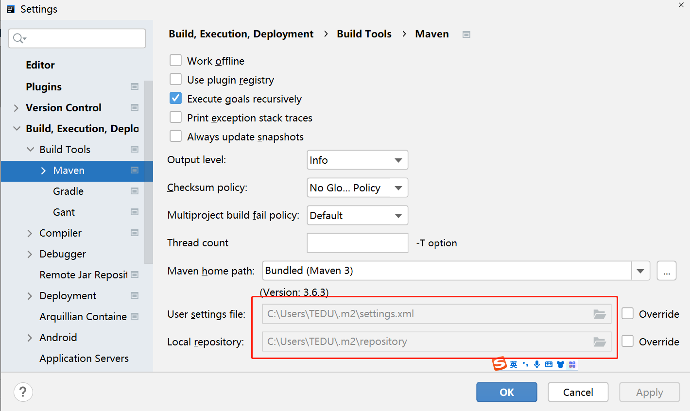
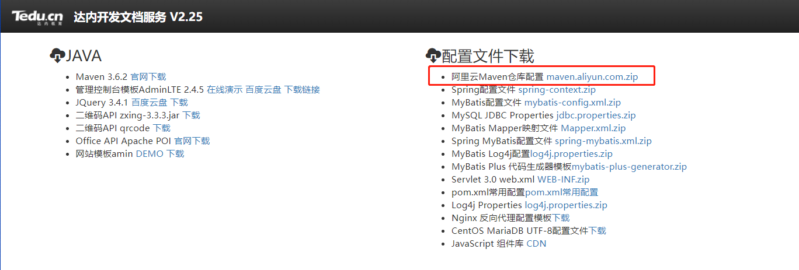
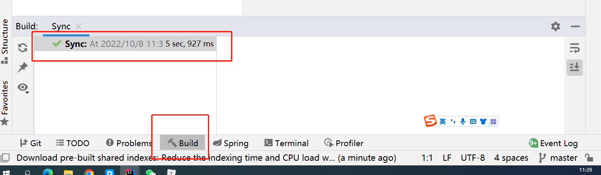
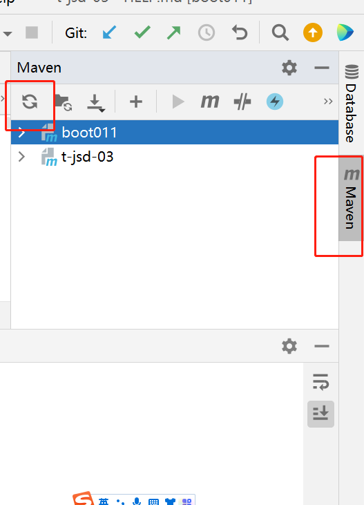
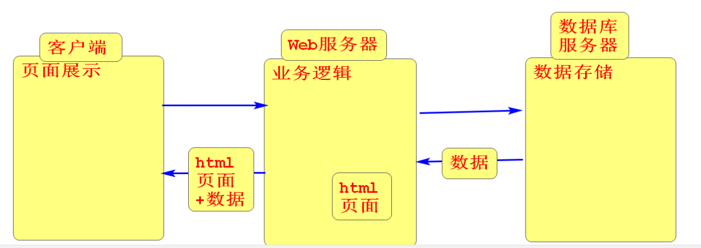

# day01  

### 配置Maven

- 检查.m2文件夹下是否有settings.xml配置文件 

  - 如何找到.m2文件夹的位置?  IDEA中 File->Settings->如下图

    

  - 如果.m2文件夹下没有settings.xml配置文件,需要从苍老师文档服务器中下载配置文件解压后保存到.m2文件夹下面

    

### 创建SpringBoot工程

1. 创建Spring Initalizer  工程,  修改URL

   推荐修改为 https://start.springboot.io  如果不能用则可以修改为https://start.aliyun.com 

2. 在第二个页面中勾选Web->Spring Web 然后点击finish 

3. 创建完工程后检查Build里面是否出现了绿色的对勾,如下图

   

4. 如果创建完没有出现绿色的对勾而是由红色的错误信息

   - 解决方案:

     - 刷新maven   , 然后再次检查是否有绿色对勾

       

     - 如果刷新maven后红色错误信息仍然存在, 则找到.m2文件夹里面的repository文件夹 删除, 然后回到idea再次刷新maven 检查是否出现绿色对勾
     - 如果以上两步都没有解决错误,大概率是因为maven配置有问题, 也可以重新创建一个新工程再次测试, 如果还是不行则联系项目经理老师现场解决.

   

### 什么是服务器?

- 服务器就是一台高性能的电脑
- 电脑上安装了提供XXX服务的软件, 则这台电脑就可以称为XXX服务器
- 举例:
  - 安装了收发邮件服务的软件, 就称为邮件服务器 
  - 安装了上传下载文件服务的软件, 就称为FTP服务器  
  - 安装了数据库软件, 就称为数据库服务器
  - 安装了Web服务软件, 就称为Web服务器

### 什么是Web服务软件?

- Web服务软件不具备任何业务功能,可以理解为一个容器, 用来装实现具体业务功能的组件(通过Servlet组件实现具体的业务功能,每一个业务功能都对应一个Servlet,Controller是将多个有相关性的Servlet整合到了一个类文件中)

- web服务软件做了哪些事? 

  - 搭建底层的网络连接

  - 负责根据客户端请求的静态资源路径找到对应的静态资源文件并响应给客户端

    - 如:  http://localhost:8088/a.jpg        b.html        c.png

  - 负责根据客户端请求的动态资源路径找到对应的Controller里面的方法并作出响应

    - 如: http://localhost:8088/regUser           /loginUser        

### 后端的三大框架

- 三大框架的作用是提高后端业务代码的开发效率

- SSM:
  - SpringMVC: 从第二个阶段开始接触 到第四阶段  
  - Spring:从第四阶段开始讲  
  - Mybatis: 从第三个阶段开始接触 讲到第四阶段  

### SpringBoot框架

- 如果不使用SpringBoot框架创建工程, 工程里面如果需要引入其框架, 除了要在pom.xml文件中添加大量的依赖信息以外, 还需要有对应的xml配置文件, 在配置文件中需要书写大量的配置代码, 这些工作都是需要程序员完成,  如果使用了SpringBoot框架创建工程,在引入其它框架时只需要通过打钩的方式引入框架,不需要书写配置文件,从而大大提高了程序员构建工程的效率.  

### 如何处理静态资源请求

- 把静态资源文件放在static文件夹中, 此文件夹里面的文件是可以直接被客户端请求的,只需要通过以下路径

  http://localhost:8080/文件名

### 如何处理动态请求

- 通过Controller控制器处理动态请求     

  - 在工程自带的包里面

  http://localhost:8080/hello 

### @ResponseBody注解

- 使用此注解修饰Controller类里面的方法后, 在方法中可以通过返回值的方式给客户端响应数据

### 客户端发出请求的几种方式

1. 通过浏览器的地址栏输入请求路径, 回车后发出请求
2. 通过超链接发出请求  
3. 通过form表单发出请求

### 获取参数的3种方式

1. 通过HttpServletRequest对象调用getParameter("xxx")方法获取参数
2. 在处理请求方法的参数列表处声明的方式获取参数, 这种写法不用一个个的去get,而且能够自动转换类型,   如果传参类型转换出错会报400错误.  
3. 当客户端传递过来的参数为多个有相关性的参数时,可以创建一个实体类用来封装传递过来的参数, 然后在处理请求的方法的参数列表处直接声明该对象类型,可以将接收到的参数直接封装到该对象中.   

### 身体质量指数BMI测试练习

1. 在首页中添加超链接 访问 /bmi.html页面

2. 创建bmi.html页面  页面中准备form表单 提交地址为/bmi   表单中提供两个文本框 获取用户输入的身高和体重, 再添加一个 提交按钮 

3. 创建BMIController.java  添加bmi方法处理 /bmi请求 ,   方法的参数列表处声明h和w两个变量,   方法中通过 BMI= 体重/(身高*身高) 这个公式得到 bmi的值 然后根据以下范围给客户端响应 不同的提示信息

   小于18.5 偏瘦      18.5~24 正常         24~28 微胖     大于28  有点胖了

