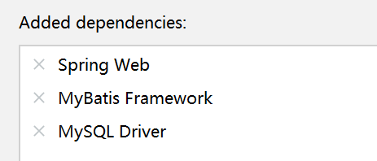
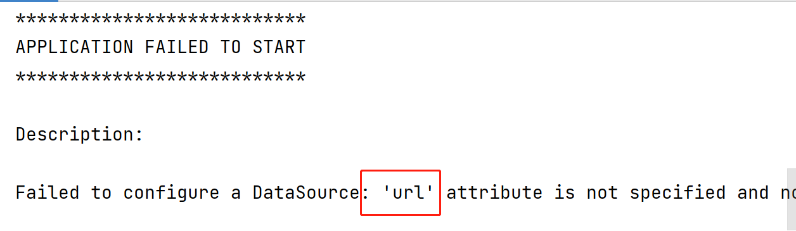
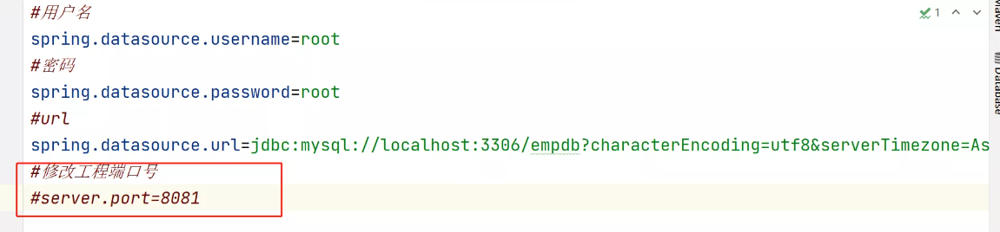
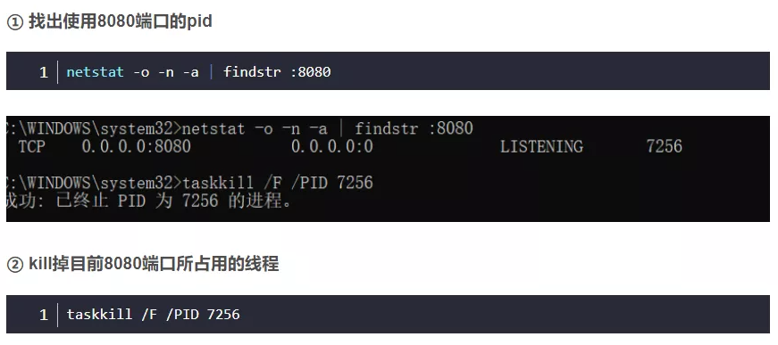

### 登录功能步骤:

1. 在首页中添加登录超链接, 请求地址为/login.html
2. 创建login.html页面 , 页面中一个文本输入框和一个密码输入框 再加一个登录按钮,提交地址为/login
3. 创建controller.UserController, 在里面添加login方法处理/login请求在参数列表处声明User接收传递过来的参数(需要提前创建User实体类)
4. 在工程的pom.xml中添加数据库相关的两个依赖, 把昨天工程中的util包复制到新工程中
5. 在login方法中通过DBUtil获取数据库连接, 然后通过JDBC代码查询user表实现登录功能

### MyBatis框架

- 此框架是目前最流行的数据持久层框架, 使用Mybatis框架后,框架可以帮助我们生成JDBC代码,从而提高开发效率,  使用此框架后 程序员只需要通过注解或xml配置文件写好需要执行的SQL语句, 框架会自动根据SQL语句帮助程序员生成对应的JDBC代码.

- 如何使用MyBatis框架?

  - 创建boot03工程   打3个勾

    

  - 如果工程中包含了Mybatis框架,启动工程时需要用到application.properties里面配置的连接数据库的信息,如果里面没有配置则启动工程时会报以下错误提示

    

### Mybatis版本商品管理系统

- 创建boot03工程, 打3个勾  分别是:Spring Web , Mybatis Framework, MySQL Driver
- 在application.properties里面添加 连接数据库的3个信息 
- 添加商品步骤:
  - 创建index.html首页, 里面添加超链接 访问/insert.html
  - 创建insert.html页面,在页面中准备3个文本框和一个提交按钮, 请求地址为/insert
  - 创建controller.ProductController 在里面添加insert方法处理/insert请求
  - 创建entity.Product实体类
  - 创建mapper.ProductMapper映射接口, 在里面添加insert方法用@Insert注解进行修饰,注解里面写插入数据的SQL语句
  - 在ProductController 里面将ProductMapper自动装配进来, 在insert方法中调用mapper的insert方法, 把接收到的Product对象传递进去
- 商品列表步骤:
  - 在首页中添加商品列表超链接 请求地址为/select  
  - 在ProductController中添加select方法处理/select请求 
  - 在ProductMapper里面添加select方法 通过@Select注解进行修饰 返回值为List集合里面装着Product
  - 在ProductController里面的select方法中 调用mapper里面的select方法,得到list集合里面装着Product对象, 遍历list集合把对象中的数据装进一个table表格标签中, 返回给客户端
- 删除商品步骤:
  - 在表格中添加删除的超链接, 请求地址为/delete?id=xxx 
  - 在ProductController中创建delete方法处理/delete请求
  - 在ProductMapper中 创建deleteById方法 用@Delete注解进行修饰 
  - 在ProductController里面的delete方法中调用mapper的deleteById方法把接收到的id参数传递进去,给客户端响应删除完成
- 修改商品步骤:
  - 在index.html首页中添加 修改商品超链接  请求地址为/update.html 
  - 创建update.html页面 ,页面中准备四个文本框和一个提交按钮 请求地址为/update
  - 在ProductController中添加update方法处理/update请求
  - 在ProductMapper中创建update方法通过@Update注解进行修饰,
  - 在ProductController里面的update方法中调用mapper的update方法,把接收到的product对象传递到方法中 最后给客户端响应 修改完成.

### 8080端口被占用

- - 解决方案:

  - - 检查是不是有其它工程正在运行,停止其它工程即可解决

    - 如果没有其它工程在运行仍然占着8080端口:

    - - 修改工程端口号, 在application.properties添加以下内容

        

- - - - 重启电脑

      - 找到占用8080端口的进制并杀掉进程

        