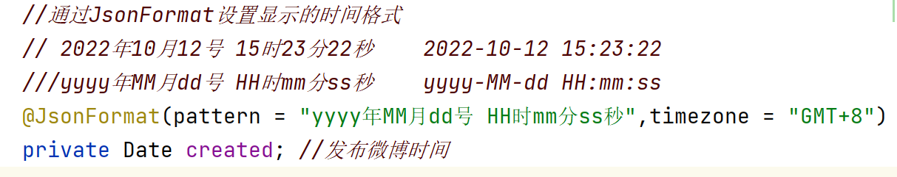
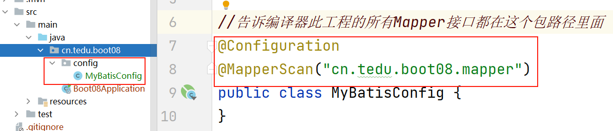
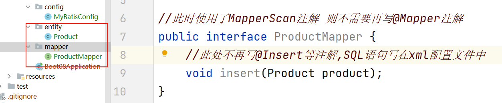
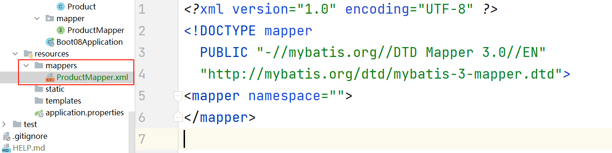
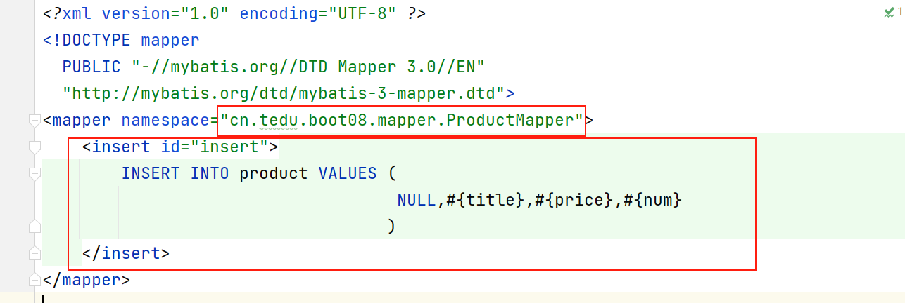
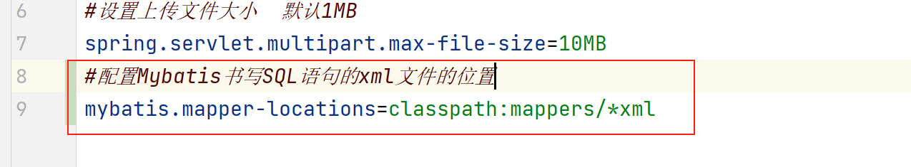
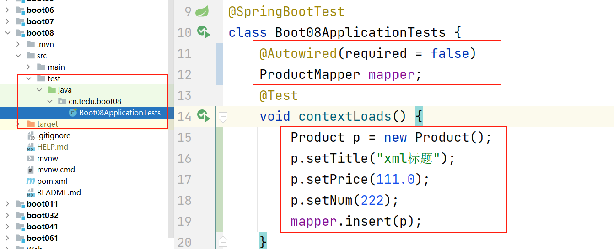

### 文件上传流程

1. 创建新工程boot071  
2. 在application.properties配置文件中添加5行内容,其中3行数据库相关, 2行文件上传相关
3. 创建index.html首页, 添加上传页面超链接 请求地址 /upload.html
4. 创建upload.html页面(从Web->day07->helloeui.html复制粘贴而来) 从elementUI文档中找到 Upload上传组件中的 照片墙, 然后把3部分代码复制到自己的页面中,给el-upload添加 action设置请求路径为/upload  添加name为pic   添加limit设置上传文件的数量
5. 创建controller.UploadController 添加 upload方法处理/upload请求 在方法中得到唯一文件名,然后把文件保存到指定的文件夹中, 把/文件名 响应给客户端  
6. 在upload.html页面中的el-upload组件里面添加:on-success="handleSuccess" 并且实现handleSuccess方法,这样上传完成后 就会响应此方法,此方法中的response参数就是服务器响应的数据,把响应的图片路径显示到页面中 

### 设置时间显示的格式

- 通过@JsonFormat注解设置显示时间的格式和时区 

### Mybatis框架在XML配置文件中书写SQL语句的用法

- 之前SQL语句是写在Mapper接口中的注解里面 

  - 如果SQL语句太长 存在字符串折行拼接问题 不够直观
  - 一些关联查询的操作不易复用 
  - 对于DBA(数据库管理员)更友好,不需要去Java代码中改SQL语句而是从配置文件中进行修改

- 详细步骤:

  - 创建boot08工程  打钩3个

  - 在application.properties里面添加链接数据库的信息

  - 创建Mybatis配置类, 通过MapperScan注解 取代每个Mapper接口类中的@Mapper注解 

    - 在工程跟目录下创建config包,在包下面创建Mybatis配置类  MybatisConfig.java 

      

  - 创建entity.Product实体类和mapper.ProductMapper

  ​		

  - 在resources目录下创建mappers文件夹, 从苍老师文档服务器中找到mapper.xml配置文件下载下来放进此文件夹中改名为ProductMapper.xml

    

  - 在ProductMapper.xml中添加以下配置内容

  

  - 在application.properties配置文件中,配置书写SQL语句的xml文件在什么位置

    

  - 在SpringBoot工程中自带的单元测试类中进行测试, 代码如下

    

### 晚课7:40 讲项目峰会 项目选题

- 商城项目:
  - C2C商城: 消费者对消费者,   包括: 淘宝,京东,拼多多
  - B2C商城:商家对消费者, 包括: 华为商城,小米商城

- 不推荐项目:  听音乐,看电影,看小说,看漫画,游戏,C2C商城,办公OA系统(因为有非常成熟的工作流框架) 
- 推荐项目: B2C商城, 卖耳机的网站,培训机构网站,卖电动车,照相馆, 小的旅游景点, 管理系统(仓库,进销存,小区物业,图书馆)

- 前后端代码量比例  尽量控制前端代码在30%左右   后端70% 
- 评判标准:
  - 网站业务量( 通过表的数量, Controller数量, Controller里面处理请求的方法数量, 总代码量)
  - 课外技术点数量 
  - 页面美观度 
  - 讲解过程 

