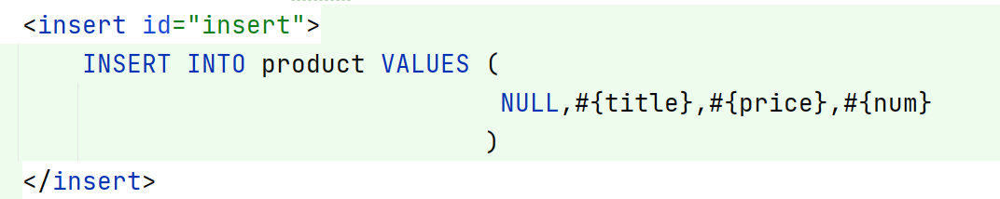
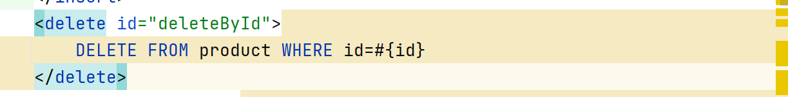
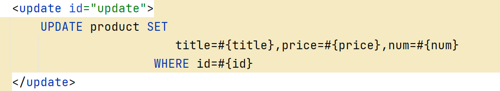
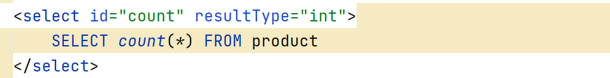
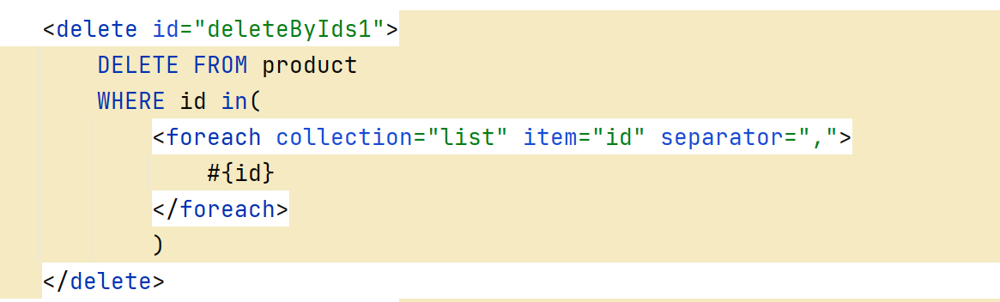
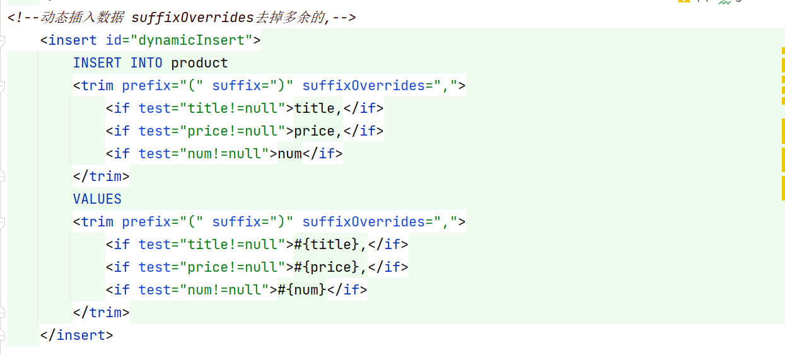
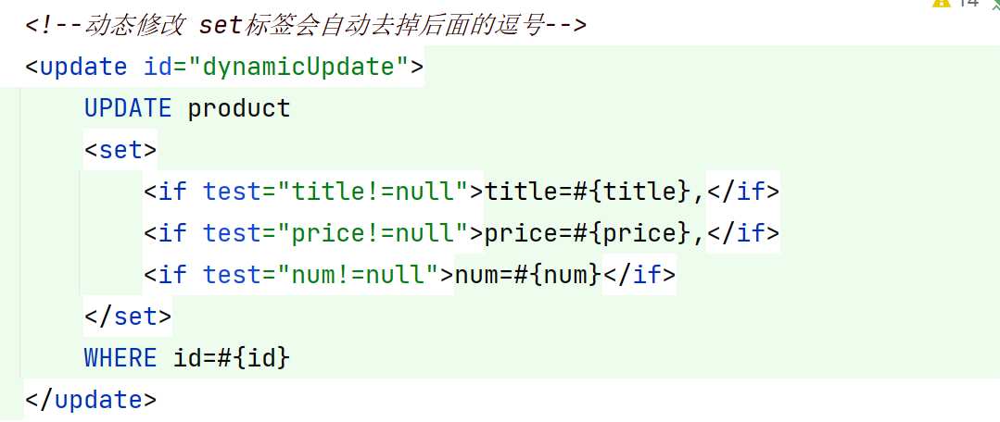
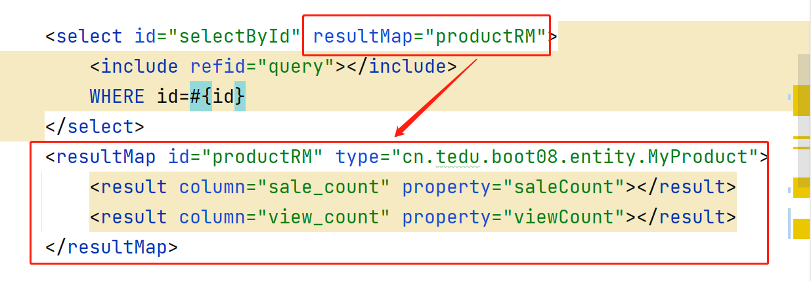
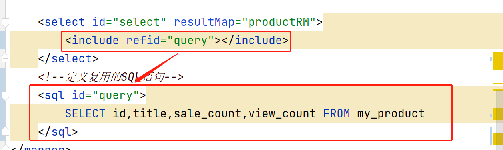

### 基础增删改查

- 插入数据

  

- 删除数据

  

- 修改数据

  

- 查询数据

  - 查询一个和查询多个

    

  - 统计数量

    

### 动态SQL

1. 批量删除数据   如果参数类型是List集合则collection写list,如果不是则写array

   

2. 批量添加

3. 动态修改

   

4. 字段名和属性名不一致时手动映射

   

5. SQL语句重用

   

### 综合练习

1. 创建员工表

   create table emp(id int primary key auto_increment,name varchar(20),salary int,job varchar(20),manager_id int);

2. 创建boot09工程,在新工程中实现以下功能

   - 普通添加员工和批量添加
   - 通过id删除,批量删除
   - 动态修改
   - 通过id查询, 查询所有,统计数量

### 关联查询

- 准备工作:

  - 创建boot10工程 ,在application.properties配置文件中添加配置信息

  - 创建球队和球员表

    create table team(id int primary key auto_increment,name varchar(20),loc varchar(20));

    create table player(id int primary key auto_increment,name varchar(20),team_id int);

    insert into team values(null,'公牛队','芝加哥'),(null,'火箭队','休斯顿');

    insert into player values(null,'乔丹',1),(null,'皮蓬',1),(null,'姚明',2),(null,'麦迪',2);

### POJO 

- pojo指简单的Java对象  是实体类Entity和 值对象VO 还有DTO数据传输对象的统称
- Entity实体类,通常和对应的表字段的数量是一致的 
- DTO数据传输对象, 当客户端给服务器传递参数时,参数的数量可能比实体类中的数量要少,比如实体类中有10个参数 但是客户端只传递过来的3个参数,此时通过DTO接收传递过来的参数,如果使用实体类接收也可以但是会存在很多的null值,使用DTO好处是只要发现null值就能判断出传输出错了
- VO值对象, 从数据库中的某个表查询数据,有多种场景,有的需要查全部,而有的查询只需要查一部分数据,如果只查一部分数据查询回来的数据直接用Entity接收封装的话,则Entity中会存在大量的null值, 这些null值传输给客户端也会占用流量,浪费资源,使用VO则可以解决此问题

