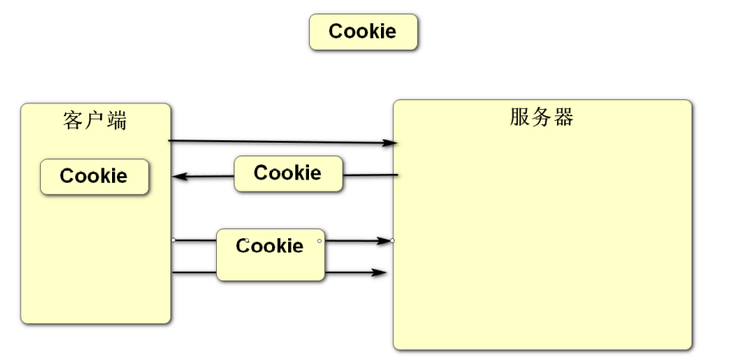
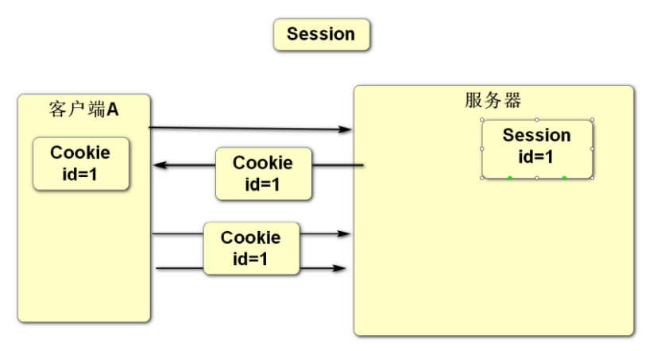

### 项目第三天功能实现顺序:

1. 首页商品列表展示
2. 商品详情页面
3. 增加浏览量
4. 商品分类

### timestamp时间戳类型当数据发生更改时会自动更新时间为当前时间

- 关闭自动更新时间:

  use cs;

  alter table product change created created timestamp not null default current_timestamp;

- 打开自动更新时间:

  alter table product change created created timestamp not null default current_timestamp on update current_timestamp;

### 会话管理

- 客户端和服务器之间进行数据交互遵循的是HTTP协议, 此协议是无状态协议(一次请求对应一次响应,响应完之后断开连接) 服务器是无法跟踪客户端的请求, 通过Cookie技术可以给客户端添加一个标识(此标识可以保存数据), 客户端之后向此服务器发请求时会自动带上这个标识,这样服务器就可以识别此客户端了, 但是由于Cookie的数据是保存在客户端中,存在被篡改的风险, Session可以避免出现这样的风险,因为Session数据是保存在服务器  
- 通过会话管理Cookie和Session可以保存客户端的数据, 数据库保存的是用户的数据.

- Cookie: 数据保存在客户端(类似于打孔式的会员卡)

  - 数据默认保存在浏览器的内存中,当浏览器关闭时数据会清除, 可以设置保存时间(任意时间),设置之后数据会保存在客户端的磁盘中,时间到了之后自动清除

  - 只能保存字符串类型数据

  - Cookie是存在客户端浏览器中每次请求会存放在请求头中,所以cookie只可以保存几k的数据  

  - 应用场景: 记住用户名和密码

    

- Session:数据保存在服务器(类似于银行卡) 

  - 数据保存在服务器的内存中,保存时间只有半个小时左右   
  - 可以保存任意对象类型的数据
  - Session保存数据量没有大小限制,但也不建议保存大量数据
  - 应用常见: 记住登录状态  

### 通过Cookie实现记住用户名和密码

