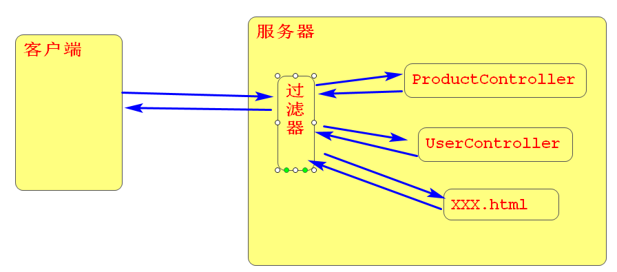

### 过滤器Filter

- 作用: 可以让客户群请求到服务器资源之前或之后经过过滤器

- 如何使用过滤器?
  - 创建Filter类文件		
  - 在WebFilter注解中配置处理的请求路径
  - 在doFilter方法中处理请求,写上判断代码,条件满足执行chain.doFilter(request, response);代码代表放行.
  - 在XXXXApplication.java文件中添加@ServletComponentScan注解 进行过滤器扫描
- 过滤器urlParttens配置方式
  - 精确匹配:   /admin.html  /insertProduct.html  
  - 后缀匹配:  *.jpg     *.html      *.xxx
  - 路径匹配:  /product/*       /user/*   
  -  全部匹配: /*   (匹配网站中所有资源 )

