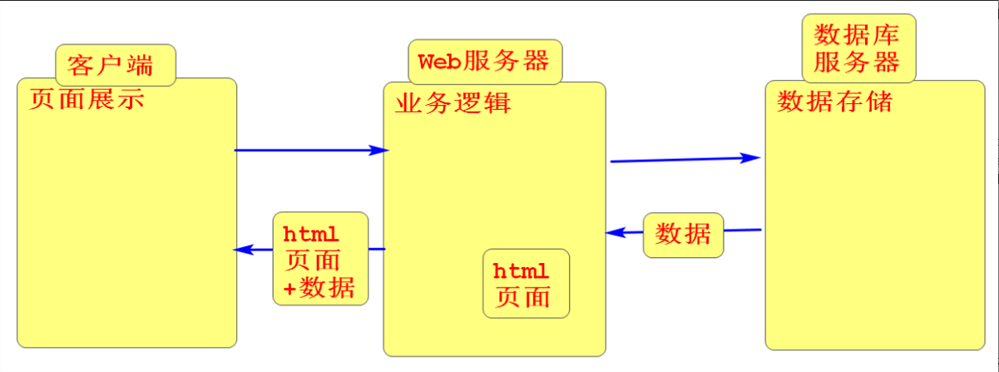

## 内容介绍:


- Web前端（7-8）： 学习如何开发页面。
- SpringBoot（6）：学习如何接收请求以及如何作出响应。
- 项目（4）：    酷鲨商城（引流版）
- 项目峰会（1-2）


### HTML

- 作用: 学习如何搭建页面结构和准备页面内容 （盖房子）
- HyperTextMarkupLanguage超文本标记语言
- 超文本： 不仅仅是纯文本还包括字体效果和多媒体相关（音频，视频，图片）

### 创建HTML页面


### 文本相关标签

1. h1-h6 内容标题

   特点： 字体加粗   自带上下的间距  独占一行

2. 段落标签p

   特点： 自带上下间距  独占一行

3. 水平分割线hr
4. 换行br     html页面中无法识别回车换行（只能识别出一个空格）
5. 加粗b
6. 斜体i
7. 删除线s
8. 下划线u

### 列表标签

1. 无序列表： ul和li        ul:unordered list 无序列表    li:list item 列表项
2. 有序列表:    ol 和li        ordered list
3. 列表嵌套: 有序列表和无序列表可以任意无限嵌套

### 图片标签img

- src: 设置图片路径,
  - 可以访问站内资源
    - 图片和页面在同级目录: 直接写图片名
    - 图片在页面的上级目录: ../图片名(一个../代表往上一级)
    - 图片在页面的下级目录: 文件夹名/图片名
  - 也可以访问站外资源, 称为图片盗链, 有找不到图片的风险 
- alt: 当图片不能正常显示时显示的文本
- title: 当鼠标在图片上悬停时显示的文本
- width/height: 设置宽高,     两种赋值方式: 1.像素  2. 百分比    只设置宽度时高度会自动等比例缩放

### 超链接a

- href: 类似于图片标签的src属性,设置资源路径
- 页面内部跳转: 在目的地元素里面添加个id  然后在超链接中 href="#id" 就可以跳转到目的地的位置
- a标签包裹文本为文本超链接, 包裹图片为图片超链接

### 表格标签table

- 相关标签: table表格   tr表示行  td表示列 caption表格标题 th表头
- 相关属性: border边框    colspan跨列   rowspan跨行

### 表单form

- 作用: 获取用户输入的内容,并提交给服务器
- 学习表单主要学习的就是有哪些控件, 包括: 文本框,密码框,单选,多选,下拉选等
- 相关代码:

```html
<form action="http://www.tmooc.cn">
    <!--所有控件必须添加name属性,否则将不会提交参数
maxlength最大字符长度 value设置默认值 readonly只读  placeholder占位符提示输入指定内容-->
    用户名:<input type="text" name="name" maxlength="5"
               value="2168149199" readonly
               placeholder="用户名"><br>
    密码:<input type="password" name="password" placeholder="密码"><br>
    <!--单选radio的value属性必须添加 否则提交的是on checked默认选中-->
    性别:<input type="radio" name="gender" checked value="man" id="r1">
    <label for="r1">男</label> <!--扩大点击范围-->
    <input type="radio" name="gender" value="woman" id="r2">
    <label for="r2">女</label><br>
    <!--多选checkbox属性和单选属性写法一样  value和checked...-->
    兴趣爱好:<input type="checkbox" name="hobby" value="cy">看书
    <input type="checkbox" name="hobby" value="hj">写字
    <input type="checkbox" name="hobby"  checked value="tt">绘画<br>
    <!--日期选择器-->
    生日:<input type="date" name="birthday"><br>
    <!--文件选择器-->
    靓照:<input type="file" name="pic"><br>
    <!--下拉选-->
    所在地:
    <select name="city">
        <!--value设置提交的内容,如果没有value则提交标签体的文本-->
        <option value="京">北京</option>
        <option selected value="沪">上海</option>
        <option value="粤">广州</option>
        <option value="云">云南</option>
        <!--selected 默认选中-->
        <option value="贵">贵州</option>
        <option value="川">四川</option>
    </select><br>
    <input type="submit" value="注册">
    <input type="reset" value="重新设置">
    <!--自定义按钮button-->
    <input type="button" value="按钮">
    <hr>
    <button type="submit">注册</button>
    <button type="reset">重置</button>
    <button type="button">按钮</button>
</form>
```

### 分区标签

- 作用: 可以理解为一个容器, 把多个有相关性的标签装进一个分区标签中, 可以进行统一管理.  
- 常见的分区标签:
  - div: 独占一行
  - span:共占一行 
- 页面如何进行区域划分?
  - 一般情况下一个页面由个大区组成, 每个大区里面又有n个小的区域
- HTML5标准中新增的分区标签, 作用和div是一样的 为了提高代码的可读性
  - header头
  - main主体
  - footer脚
  - nav导航
  - section区域

### CSS

- Cascading Style Sheet 层叠样式表

- 作用： 美化页面（装修）

### 如何在html页面中写CSS样式代码

- 三种引入方式:
  - 内联样式: 在标签的style属性中添加样式代码, 弊端:不能复用
  - 内部样式: 在head标签里面添加style标签,在标签体内写样式代码, 可以复用,但是只能在当前页面复用 不能多页面复用  
  - 外部样式: 在单独的css样式文件中写样式代码, 在html页面中通过link标签引入,可以实现多页面复用.  
- 工作中外部样式使用的更多因为可以多页面复用而且可以将html代码和css样式代码分离开 便于维护  

### 选择器

1. 标签名选择器: 匹配页面中所有同名标签

   格式: 标签名{样式代码}

2. id选择器:  当需要选择页面中某一个元素时使用

   格式: #id{样式代码}

3. 类选择器: 当需要选择页面中多个不相关的元素时,给元素添加相同的class属性值

   格式:.class{样式代码}

4. 分组选择器:  可以将多个选择器合并成一个选择器   

   格式: div,#id,.class{样式代码}

5. 属性选择器: 通过元素的属性选择元素

   格式: 标签名[属性名='值']{样式代码}   

6. 任意元素选择器:  匹配页面中所有元素

   格式: *{样式代码}

7. 子孙后代选择器: 通过元素和元素之间关系 匹配某一层元素以及这一层内部的所有

   格式: body div div p{样式代码}  匹配body里面的div里面的div里面的所有p(包含后代)

8. 子元素选择器: 通过元素和元素之间关系 匹配某一层元素

   格式: body>div>div>p{样式代码}  匹配body里面的div里面的div里面的所有p子元素(不包含后代)

 通过内部样式实现以下功能

1. 把张学友改成绿色

2. 把刘德华和悟空改成蓝色

3. 修改取经 3 人和刘备的

   背景为黄色

4. 修改提交按钮的背景为红色,
  自定义按钮的字为粉色

5. 给所有元素添加红色的边框


